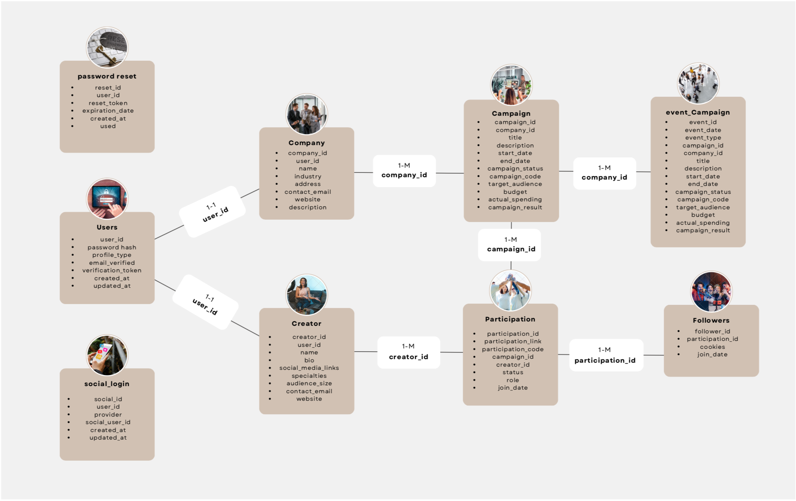

## Data Model Structure

### 1. Users
- **Fields:**
  - `user_id`: Unique identifier for the user.
  - `password_hash`: Hashed password for security.
  - `profile_type`: Type of user profile.
  - `email_verified`: Boolean indicating if the email associated with the user account is verified.
  - `verification_token`: Token used for verifying the user's email.
  - `created_at`: Date and time the user was created.
  - `updated_at`: Date and time the user was last updated.

### 1.1. PasswordReset
- **Fields:**
  - `reset_id`: Identifier for the reset record.
  - `user_id`: Links to the Users table (1-M relationship).
  - `reset_token`: Token used for verifying the reset request.
  - `expiration_date`: Date and time when the token expires.
  - `created_at`: Date and time when the reset request was created.
  - `used`: Boolean indicating if the reset token has been used.

### 1.2. SocialLogin
- **Fields:**
  - `social_id`: Unique identifier for the social login record.
  - `user_id`: Links to the Users table (1-M relationship).
  - `provider`: Social login provider (e.g., Google, Facebook).
  - `social_user_id`: Identifier for the user on the social platform.
  - `created_at`: Date and time the social login was created.
  - `updated_at`: Date and time the social login was last updated.

### 2. Company
- **Fields:**
  - `company_id`: Unique identifier for the company.
  - `user_id`: Links to the Users table (1-M relationship).
  - `name`: Name of the company.
  - `industry`: Industry sector of the company.
  - `address`: Physical address of the company.
  - `contact_email`: Contact email for the company.
  - `website`: Company website URL.
  - `description`: Brief description of the company.

### 3. Creator
- **Fields:**
  - `creator_id`: Unique identifier for the creator.
  - `user_id`: Links to the Users table (1-M relationship).
  - `name`: Name of the creator.
  - `bio`: Biography of the creator.
  - `social_media_links`: Links to the creator's social media profiles.
  - `specialties`: Creator's areas of expertise.
  - `audience_size`: Size of the creator's audience.
  - `contact_email`: Contact email for the creator.
  - `website`: Creator's website URL.

### 4. Campaign
- **Fields:**
  - `campaign_id`: Unique identifier for the campaign.
  - `company_id`: Links to the Company table (1-M relationship).
  - `title`: Title of the campaign.
  - `description`: Description of the campaign.
  - `start_date`: Start date of the campaign.
  - `end_date`: End date of the campaign.
  - `campaign_status`: Status of the campaign (e.g., active, completed).
  - `campaign_code`: Unique code for the campaign.
  - `target_audience`: Target audience for the campaign.
  - `budget`: Budget allocated for the campaign.
  - `actual_spending`: Actual spending on the campaign.
  - `campaign_result`: Results of the campaign.

### 5. Participation
- **Fields:**
  - `participation_id`: Unique identifier for the participation.
  - `participation_link`: Link to the participation content.
  - `participation_code`: Code used for participation tracking.
  - `campaign_id`: Links to the Campaign table (1-M relationship).
  - `creator_id`: Links to the Creator table (1-M relationship).
  - `status`: Status of the participation (e.g., active, completed).
  - `role`: Role of the participant in the campaign.
  - `join_date`: Date the participant joined the campaign.

### 6 Followers
- **Fields:**
  - `follower_id`: Unique identifier for the follower.
  - `participation_id`: Links to the Participation table (1-M relationship).
  - `cookies`: Cookies used for tracking the follower.
  - `join_date`: Date the follower joined.
